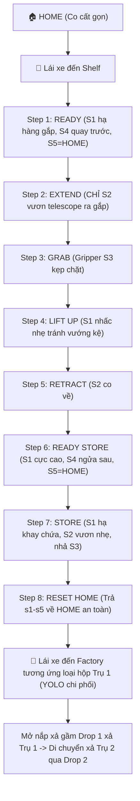

# KẾ HOẠCH TRIỂN KHAI: HỆ THỐNG TUNING & CHU TRÌNH GẮP THẢ ROBOT (LẬT THẲNG)

Tài liệu này tổng hợp toàn bộ kế hoạch triển khai, cấu trúc robot thực tế, và hướng dẫn chi tiết cách vận hành tuning bằng tay cầm kết hợp Panels.

---

## 1. PHÂN TÍCH CHU TRÌNH TUẦN HOÀN 1 BOX CHUẨN THỰC TẾ (SWING KHÓA)
Cánh tay gắp (Pick Arm) hoạt động lật thẳng trục ở giữa, S5 khóa cứng tại `S5_HOME` (0.0). Việc gắp/thả dựa trên lộ trình di chuyển của Pedro Pathing và nhận dạng YOLO cho 2 trụ chứa trong robot.

### Bảng Trạng Thái Servo Từng Bước (Cycle Matrix)

| Bước | Tên Bước | S1 (Lift) | S2 (Telescope) | S3 (Gripper) | S4 (Wrist) | S5 (Swing) | Ý Nghĩa Cơ Bản |
|------|----------|-----------|----------------|--------------|------------|------------|----------------|
| **0** | **HOME** | `S1_HOME` (0.5) | `S2_HOME` (0.75) | `S3_OPEN` (0.0) | `S4_GRAB` (0.0) | `S5_HOME` (0.0) | Cơ cấu thu gọn |
| **1** | **READY** | `S1_ROW1/2` | `S2_HOME` (0.75) | `S3_OPEN` (0.0) | `S4_GRAB` (0.0) | `S5_HOME` (0.0) | S1 hạ hàng gắp, S4 hướng trước, S5 ở CENTER |
| **2** | **EXTEND** | giữ Step 1 | `S2_EXTEND` (1.0) | giữ Step 1 | giữ Step 1 | giữ Step 1 | CHỈ S2 duỗi ra gắp hộp |
| **3** | **GRAB** | giữ Step 2 | giữ Step 2 | `S3_CLOSED` (0.1)| giữ Step 2 | giữ Step 2 | Gripper S3 kẹp chặt hộp |
| **4** | **LIFT UP**| `S1_ROW_x - S1_LIFT_UP_OFFSET` | giữ Step 3 | giữ Step 3 | giữ Step 3 | giữ Step 3 | Nhấc nhẹ hẳn lên tránh va quẹt kệ |
| **5** | **RETRACT**| giữ Step 4 | `S2_HOME` (0.75) | giữ Step 4 | giữ Step 4 | giữ Step 4 | Co telescope thu cánh tay về |
| **6** | **H-STORE**| `S1_HIGH_STORE` (0.2)| giữ Step 5 | giữ Step 5 | `S4_STORE` (0.75)| `S5_HOME` (0.0) | S1 dâng cực cao, S4 ngửa thẳng ra sau |
| **7** | **STORE** | `S1_STORE` (0.0) | `S2_STORE` (0.75)| `S3_OPEN` (0.0) | giữ Step 6 | giữ Step 6 | Hạ cánh tay vào khay cất, S2 duỗi nhẹ, nhả S3 |
| **8** | **RESET** | `S1_HOME` | `S2_HOME` | `S3_HOME` | `S4_HOME` | `S5_HOME` | Reset HOME an toàn |

---

## 2. GIAO DIỆN PHẦN CỨNG & CHỐNG BOTTLENECK I2C
Để tránh hiện tượng đứng khựng, lag do ghi giá trị I2C liên tục xuống servo gầm PCA9685 và các servo khác:
- Áp dụng hệ thống cache trước khi ghi (Servo writing debounce).
- Chỉ cho phép ghi `setPosition()` / gửi câu lệnh I2C khi góc thực tế có thay đổi khác biệt `> 0.0005`.

---

## 3. HƯỚNG DẪN VẬN HÀNH TUNING BẰNG TAY CẦM & PANELS

Sử dụng tay cầm Gamepad 2 để điều chỉnh mọi thứ trực quan khi đứng cạnh robot:

### Sử dụng LB / RB để dịch chế độ (TUNER_MODE):
- **Bumper Trái [LB]**: Lùi chế độ mode.
- **Bumper Phải [RB]**: Tiến chế độ mode.

### Các Chế độ Cấu hình (TUNER_MODE 0 - 11):
- **MODE 0: Tune lẻ cánh tay gắp (S1-S5)**
  * **Dpad Up/Down**: Chọn từ S1-S5.
  * **Left Stick Y**: Jog góc mịn cho servo chọn.
  * **Nút A/B**: Kẹp/Mở kẹp S3.
- **MODE 1 - 8: Tune theo bước của chu trình thực tế (Swing khóa ở HOME):**
  * Robot tự động di chuyển đến tư thế của bước cơ học đó.
  * Bạn sử dụng **Left Stick Y** để jog chỉnh góc của servo chủ chốt trong bước đó (ví dụ Step 1 chỉnh hàng gắp S1, Step 2 jog S2 vươn duỗi).
  * Nhấn **[Y]** trên Gamepad 2 để lưu góc này đè trực tiếp lên hằng số trong code `BoxAutoPanels.java`.
  * Nhấn **[X]** để dừng khẩn cấp về HOME.
- **MODE 9: Tune lẻ cửa xả nắp gầm (D1-D3)**
  * **Dpad Up/Down**: Chọn nắp xả D1-D3.
  * **Left Stick Y**: Chỉnh góc mở/đóng nắp.
- **MODE 10: State Đóng khít tất cả các nắp gầm xả** (dropClosed).
- **MODE 11: State Mở cửa xả**
  * Tự động mở cửa xả tương ứng khay chứa được chọn (Dpad Left/Right chọn khay trụ 1-2).
  * **Left Stick Y**: Jog góc mở rộng cho cửa xả này.
  * Bấm **[Y]** để lưu góc mở xả của khay này vào cấu hình.
