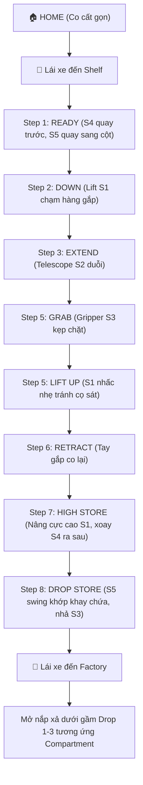

# KẾ HOẠCH TRIỂN KHAI: HỆ THỐNG TUNING & CHU TRÌNH GẮP THẢ ROBOT

Tài liệu này tổng hợp toàn bộ kế hoạch triển khai, cấu trúc robot thực tế, và hướng dẫn chi tiết cách vận hành tuning bằng tay cầm kết hợp Panels.

---

## 1. PHÂN TÍCH CHU TRÌNH TUẦN HOÀN 1 BOX
Dựa trên cơ cấu cơ khí thực tế của robot (gắp phía trước, lật sau thả vào khay trung gian, nắp gầm xả xuống sân):

### Bảng Trạng Thái Servo Từng Bước (Cycle Matrix)

| Bước | S1 (Lift) | S2 (Telescope) | S3 (Gripper) | S4 (Wrist) | S5 (Swing) |
|------|-----------|----------------|--------------|------------|------------|
| **HOME** | `S1_HOME` (0.5) | `S2_HOME` (0.75) | `S3_OPEN` (0.0) | `S4_GRAB` (0.0) | `S5_HOME` (0.0) |
| **Step 1: Ready** | giữ HOME | giữ HOME | `S3_OPEN` (0.0) | `S4_GRAB` (0.0) | `S5_LEFT/RIGHT` |
| **Step 2: Down** | `S1_ROW1/2` | giữ | giữ | giữ | giữ |
| **Step 3: Extend** | giữ | `S2_EXTEND` (0.75) | giữ | giữ | giữ |
| **Step 4: Grab** | giữ | giữ | `S3_CLOSED` (0.1) | giữ | giữ |
| **Step 5: Lift** | `S1_ROW_x - S1_LIFT_UP_OFFSET` | giữ | giữ | giữ | giữ |
| **Step 6: Retract** | giữ | `S2_HOME` (0.75) | giữ | giữ | giữ |
| **Step 7: High Store** | `S1_HIGH_STORE` (0.2) | giữ | giữ | `S4_STORE` (0.75) | `S5_HOME` (0.0) |
| **Step 8: Drop** | `S1_STORE` (0.0) | `S2_STORE` (0.75) | `S3_OPEN` (0.0) | giữ | `S5_STORE1-4` |

---

## 2. GIAO DIỆN PHẦN CỨNG & CHỐNG BOTTLENECK I2C
Để tránh hiện tượng đứng khựng, lag do ghi giá trị I2C liên tục xuống servo gầm PCA9685 và các servo khác:
- Áp dụng hệ thống cache trước khi ghi (Servo writing debounce).
- Chỉ cho phép ghi `setPosition()` / gửi câu lệnh I2C khi góc thực tế có thay đổi khác biệt `> 0.0005`.

---

## 3. HƯỚNG DẪN VẬN HÀNH TUNING BẰNG TAY CẦM & PANELS

Sử dụng tay cầm Gamepad 2 để điều chỉnh mọi thứ trực quan khi đứng cạnh robot:

### Sử dụng LB / RB để dịch chế độ (TUNER_MODE):
- **Bumper Trái [LB]**: Lùi chế độ mode.
- **Bumper Phải [RB]**: Tiến chế độ mode.

### Các Chế độ Cấu hình (TUNER_MODE 0 - 11):
- **MODE 0: Tune lẻ cánh tay gắp (S1-S5)**
  * **Dpad Up/Down**: Chọn servo muốn tune.
  * **Left Stick Y**: Điều chỉnh góc mịn của servo đang chọn.
  * **Nút A/B**: Đóng/Mở gripper s3 nhanh để test lực kẹp.
- **MODE 1 - 8: Tune theo bước của chu trình:**
  * Robot tự động di chuyển đến tư thế của bước cơ học đó.
  * Bạn sử dụng **Left Stick Y** để jog chỉnh góc của servo chủ chốt trong bước đó (ví dụ Step 3 chỉnh S2 vươn ra, Step 8 chỉnh swing S5 để khớp miệng khay chứa 1-4).
  * Nhấn **[Y]** trên Gamepad 2 để lưu góc này đè trực tiếp lên hằng số trong code `BoxAutoPanels.java`.
  * Nhấn **[X]** để dừng khẩn cấp về HOME.
- **MODE 9: Tune lẻ cửa xả nắp gầm (D1-D3)**
  * **Dpad Up/Down**: Chọn nắp xả.
  * **Left Stick Y**: Chỉnh góc mở/đóng nắp.
- **MODE 10: State Đóng khít tất cả các nắp gầm xả** (dropClosed).
- **MODE 11: State Mở cửa xả**
  * Tự động mở cửa xả tương ứng khay chứa được chọn (Dpad Left/Right chọn khay 1-4).
  * **Left Stick Y**: Jog góc mở rộng cho cửa xả này.
  * Bấm **[Y]** để lưu góc mở xả của khay này vào cấu hình.
